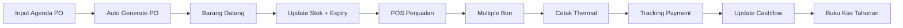

# 📊 Agenda Management Enhancement - Client Presentation

## 🎯 **Overview**
Enhancement sistem untuk mengintegrasikan agenda cashflow dan purchase order dalam satu interface yang user-friendly, dengan tambahan fitur POS kasir yang lebih powerful.

---

## 🔄 **Current vs Future State**

### **Current System Issues:**
❌ Menu terpisah (Cashflow, PO, Incoming Goods)  
❌ Input barang satu per satu (tidak efisien)  
❌ Tidak ada tracking expired date  
❌ POS hanya 1 bon per transaksi  
❌ Tidak ada cetak thermal  
❌ Payment status tracking terbatas  

### **Enhanced System Benefits:**
✅ Single page dengan 2 tab terintegrasi  
✅ Input total barang (lebih cepat)  
✅ Batch expiration tracking  
✅ Multiple bon per transaksi  
✅ Cetak thermal 80x100mm  
✅ Complete payment status tracking  

---

## 🏗️ **New Architecture**

### **Single Page Interface**
```
📊 Agenda Management
┌─────────────────────────────────────────────────────────┐
│ 💰 Tab 1: Agenda Cashflow    📦 Tab 2: Purchase Order   │
├─────────────────────────────────────────────────────────┤
│                                                         │
│  • Input omset harian                                  │
│  • Tracking payment (cash/QR/EDC)                      │
│  • Summary buku kas tahunan                            │
│                                                         │
│  • Input: PT, Jatuh Tempo, Total                      │
│  • Auto-generate PO number                             │
│  • Expired date tracking                               │
│                                                         │
└─────────────────────────────────────────────────────────┘
```

---

## 📦 **Agenda Purchase Order Enhancement**

### **Input Sederhana (Baru)**
```
┌─────────────────────────────────────┐
│ 📝 Tambah Agenda Barang Datang      │
├─────────────────────────────────────┤
│ PT (Supplier): [Dropdown ▼]        │
│ Jatuh Tempo:  [Date Picker 📅]     │
│ Total Belanja: [Rp 1.000.000]     │
│ Expired Date:  [Date Picker 📅]    │
│ Batch Number: [AUTO-GENERATE]      │
│                                     │
│ [✓] Auto-generate PO Number        │
│                                     │
│            [SIMPAN]                 │
└─────────────────────────────────────┘
```

### **Benefits:**
- ⚡ **3x lebih cepat** - Input total langsung
- 📅 **Expired tracking** - Tidak ada barang kadaluarsa
- 🏷️ **Auto PO** - Nomor PO otomatis tergenerate
- 🔗 **Supplier link** - Terhubung dengan data supplier

---

## 💰 **Agenda Cashflow Enhancement**

### **Payment Method Tracking**
```
┌─────────────────────────────────────┐
│ 💰 Cashflow Hari Ini                │
├─────────────────────────────────────┤
│ Total Omset:    Rp 5.000.000       │
│ └─ Ecer:         Rp 2.000.000       │
│ └─ Grosir:       Rp 3.000.000       │
│                                     │
│ 💳 Payment Methods:                 │
│ └─ Cash:         Rp 2.500.000       │
│ └─ QR:           Rp 1.500.000       │
│ └─ EDC:          Rp 1.000.000       │
│                                     │
│ 📊 Net Cashflow: Rp 5.000.000       │
└─────────────────────────────────────┘
```

### **Annual Summary (Buku Kas)**
```
📈 Summary Tahun 2024
┌─────────────────────────────────────┐
│ 📊 Pemasukan:   Rp 150.000.000      │
│ 💸 Pengeluaran: Rp 120.000.000      │
│ 💰 Net Profit:  Rp 30.000.000       │
│                                     │
│ 📈 Grafik Trend 12 Bulan            │
│ ▂▃▅▂▃▅▂▃▅▂▃▅▂▃▅                   │
└─────────────────────────────────────┘
```

---

## 🛒 **POS Kasir Enhancement**

### **Multiple Bon per Transaksi**
```
🛒 POS Kasir - Transaksi #1234
┌─────────────────────────────────────┐
│ Customer: Toko ABC                 │
│ ┌─────────────────────────────────┐ │
│ │ 🧾 Bon #1 - Rp 500.000         │ │
│ │ Customer: Budi                 │ │
│ │ Status: ✅ Lunas               │ │
│ │ [🖨️ Cetak] [📝 Detail]         │ │
│ └─────────────────────────────────┘ │
│ ┌─────────────────────────────────┐ │
│ │ 🧾 Bon #2 - Rp 300.000         │ │
│ │ Customer: Ani                 │ │
│ │ Status: ⏳ Sebagian (Rp 150k)  │ │
│ │ [🖨️ Cetak] [💳 Bayar]         │ │
│ └─────────────────────────────────┘ │
│                                     │
│ [+ Tambah Bon] [💰 Selesaikan]      │
└─────────────────────────────────────┘
```

### **Thermal Print (80x100mm)**
```
═════════════════════════════════════
           INVOICE
No: INV-202410001
Tanggal: 14/10/2024 13:45
Kasir: Admin
───────────────────────────────────────
Pelanggan: Toko ABC
───────────────────────────────────────
Item                    Qty    Total
Product A               5    250,000
Product B               3    250,000
───────────────────────────────────────
Subtotal:              500,000
TOTAL:                 500,000
Pembayaran: CASH
───────────────────────────────────────
         TERIMA KASIH
═════════════════════════════════════
```

### **Payment Status Tracking**
```
📊 Status Pembayaran Nota
┌─────────────────────────────────────┐
│ ✅ Lunas:         15 nota          │
│ ⏳ Sebagian:       3 nota           │
│ ❌ Belum Bayar:    2 nota           │
│                                     │
│ 💰 Total Piutang: Rp 450.000       │
└─────────────────────────────────────┘
```

---

## 🔄 **Integration Flow**

### **Complete Workflow**


### **System Integration**
```
🔗 Data Flow Integration
┌─────────────────┐    ┌─────────────────┐
│  Supplier Data  │◄──►│  Agenda PO      │
└─────────────────┘    └─────────────────┘
                                │
┌─────────────────┐    ┌─────────────────┐
│ Capital Tracking│◄──►│  Cashflow       │
└─────────────────┘    └─────────────────┘
                                │
┌─────────────────┐    ┌─────────────────┐
│  Cash Ledger    │◄──►│  POS Kasir      │
└─────────────────┘    └─────────────────┘
```

---

## 📈 **Business Benefits**

### **Efficiency Gains**
- ⚡ **Input 3x lebih cepat** - Total langsung vs per item
- 🏷️ **Auto PO generation** - Tidak perlu input manual
- 🖨️ **Direct thermal print** - One click printing
- 📊 **Real-time tracking** - Status update otomatis

### **Financial Control**
- 💰 **Complete payment tracking** - Cash/QR/EDC breakdown
- 📅 **Expired date management** - Reduce waste
- 📈 **Annual cashflow summary** - Better financial planning
- 🔍 **Piutang tracking** - Monitor outstanding payments

### **Operational Excellence**
- 📦 **Batch management** - Track expiry per batch
- 🧾 **Multiple invoices** - Flexible payment options
- 🔗 **Supplier integration** - Streamlined procurement
- 📱 **Mobile-friendly** - Access anywhere

---

## 🚀 **Implementation Timeline**

### **Phase 1: Foundation (Week 1-2)**
- ✅ Database setup & migrations
- ✅ Model updates & relationships
- ✅ Basic UI framework

### **Phase 2: Core Features (Week 3-4)**
- 🔄 Single page agenda interface
- 🔄 PO auto-generation
- 🔄 Simplified input forms

### **Phase 3: POS Enhancement (Week 5-6)**
- ⏳ Multiple bon functionality
- ⏳ Thermal printing
- ⏳ Payment status tracking

### **Phase 4: Integration (Week 7)**
- ⏳ Capital tracking link
- ⏳ Cash ledger integration
- ⏳ Annual summary reports

### **Phase 5: Testing & Launch (Week 8)**
- ⏳ User acceptance testing
- ⏳ Training & documentation
- ⏳ Go-live & support

---

## 🎯 **Success Metrics**

### **Before Implementation**
- ⏱️ Input time: 5 menit per agenda
- 📄 PO creation: Manual, 2 menit
- 🖨️ Printing: 3 langkah, 2 menit
- 📊 Reporting: Harian saja

### **After Implementation**
- ⚡ Input time: 2 menit per agenda (**60% faster**)
- 🏷️ PO creation: Otomatis, 0 detik (**100% faster**)
- 🖨️ Printing: 1 klik, 10 detik (**90% faster**)
- 📊 Reporting: Real-time + annual (**Unlimited access**)

---

## 🤝 **Next Steps**

### **Immediate Actions:**
1. ✅ **Approve architecture & timeline**
2. ⏳ **Database backup & preparation**
3. ⏳ **Development environment setup**
4. ⏳ **User training preparation**

### **Client Requirements:**
- 📋 **Approve enhancement plan**
- 💾 **Provide backup schedule**
- 👥 **Assign training coordinator**
- 📅 **Set go-live date**

---

## 📞 **Support & Contact**

### **Development Team:**
- 🏗️ **Architecture Lead**: [Contact Info]
- 💻 **Lead Developer**: [Contact Info]
- 🎨 **UI/UX Designer**: [Contact Info]
- 🧪 **QA Tester**: [Contact Info]

### **Project Timeline:**
- 📅 **Start Date**: [Date]
- 📅 **UAT Date**: [Date]
- 📅 **Go-Live**: [Date]
- 📅 **Support Period**: 30 days post-launch

---

## 🎉 **Conclusion**

Enhancement ini akan mengubah cara Anda mengelola agenda cashflow dan purchase order menjadi **lebih efisien, terintegrasi, dan user-friendly**. Dengan interface baru yang modern dan fitur-fitur powerful, Anda dapat:

- 💰 **Save 60% waktu input**
- 📊 **Real-time financial tracking**
- 🖨️ **Professional thermal printing**
- 📈 **Better business insights**

**Ready to transform your business management? Let's get started! 🚀**