# 🔄 System Flow Diagrams

## 📊 **Current System Flows**

### **1. Purchase Order Flow**
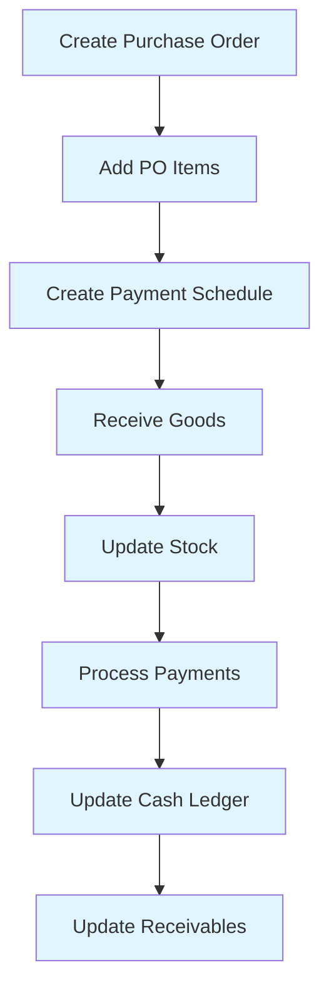

### **2. Sales Flow**
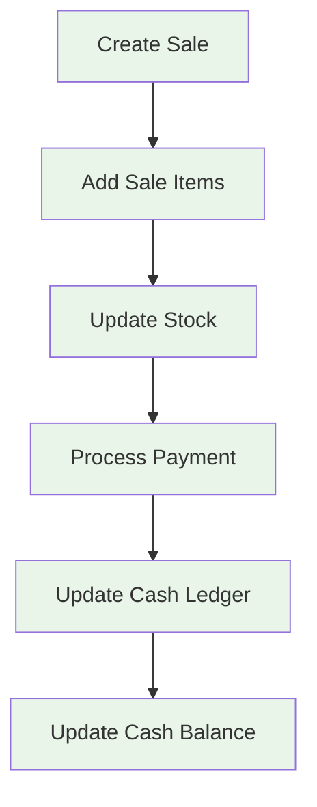

### **3. Inventory Management Flow**
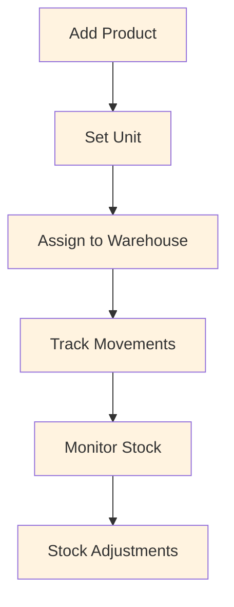

### **4. Financial Flow**
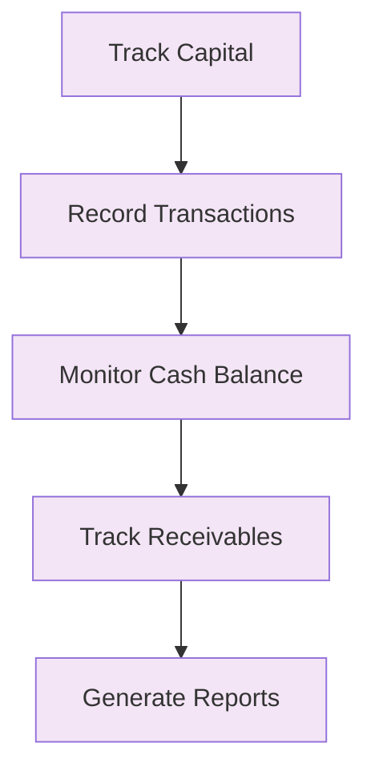

---

## 🚀 **Enhanced System Flows**

### **1. Enhanced Agenda Management Flow**
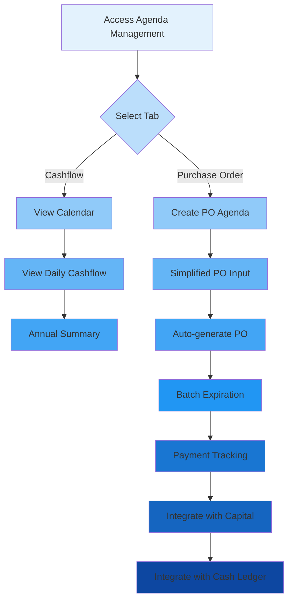

### **2. Enhanced POS Flow**
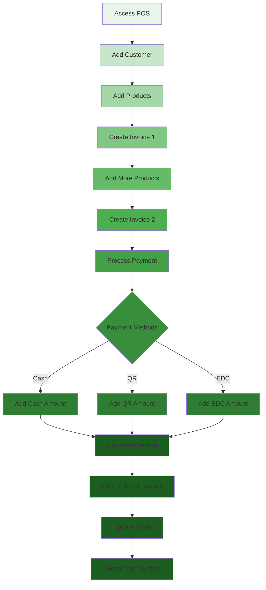

### **3. Batch Expiration Management Flow**
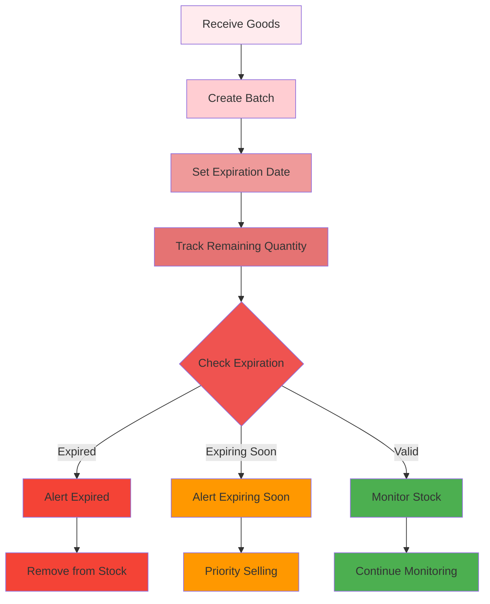

---

## 📈 **Enhanced Payment Tracking Flow**

### **Payment Method Breakdown**
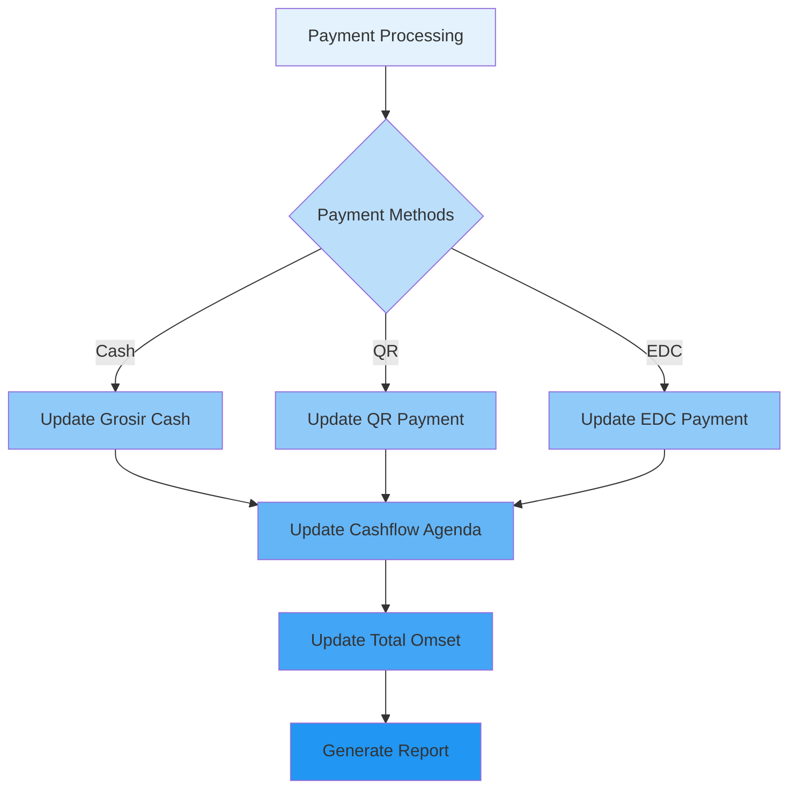

---

## 🔗 **Enhanced Entity Relationships**

### **1. Enhanced Agenda Relationships**
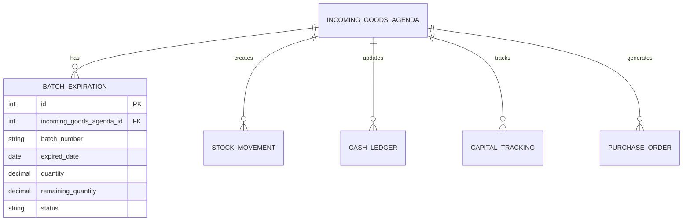

### **2. Enhanced Sales Relationships**
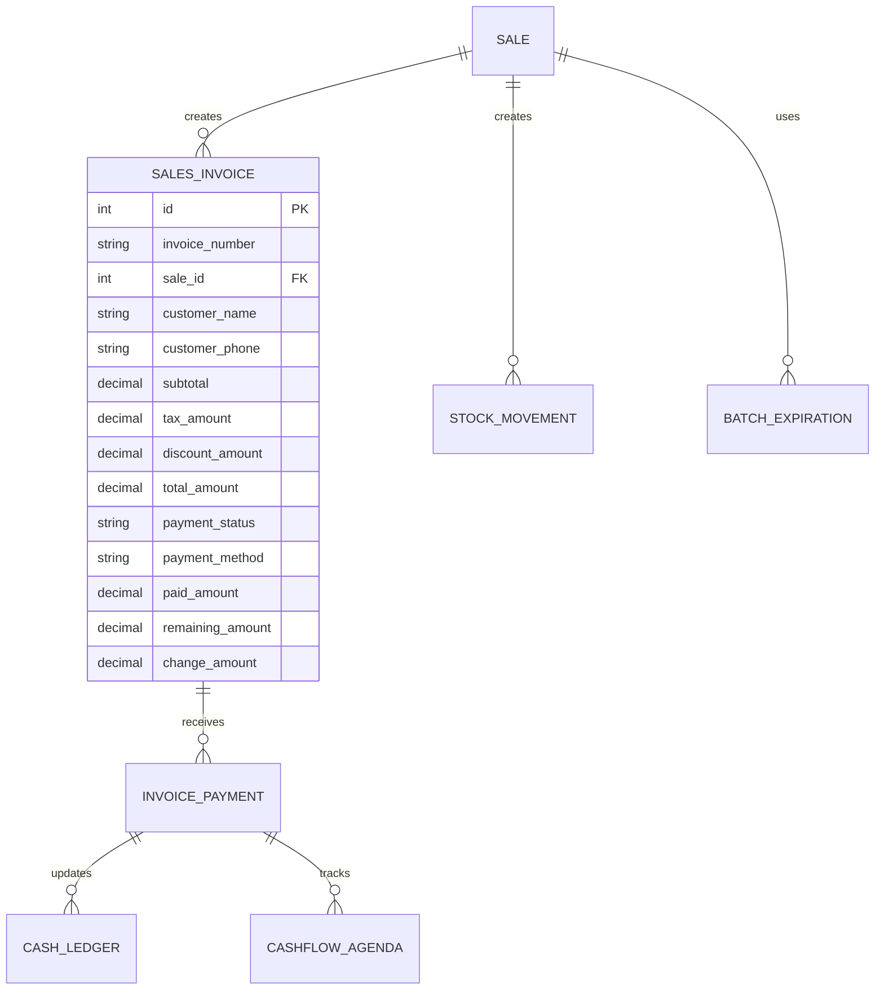

### **3. Enhanced Cashflow Relationships**
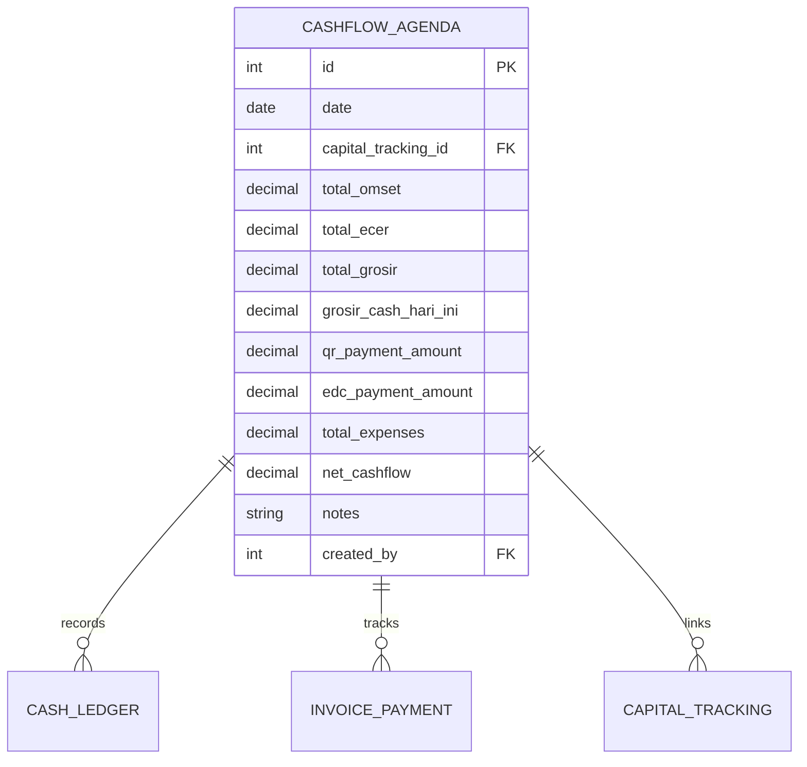

---

## 🎯 **Enhanced Feature Integration**

### **1. Single Page Agenda Integration**
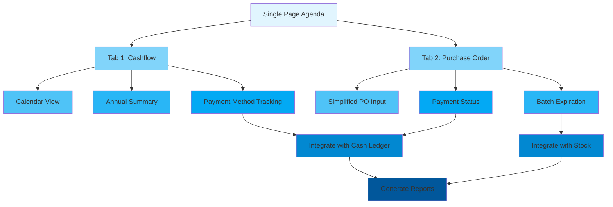

### **2. Thermal Printing Integration**
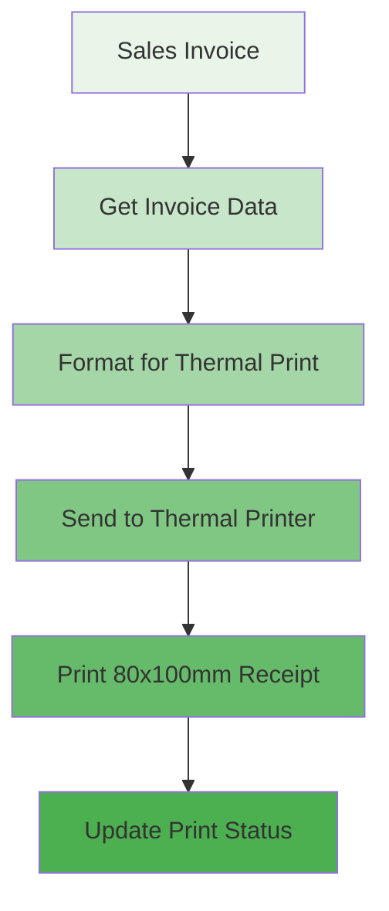

---

## 🔄 **Data Flow Between Enhanced Features**

### **1. Complete Data Flow**
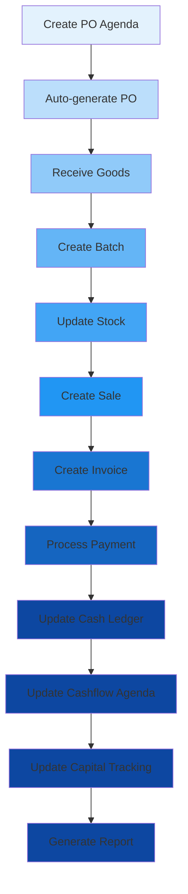

---

## 📊 **Enhanced System Metrics**

### **1. Performance Metrics**
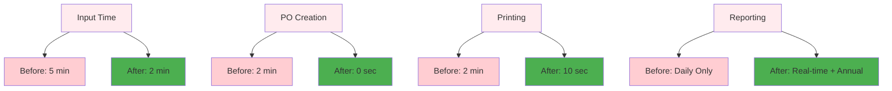

---

## 🎉 **Conclusion**

Enhanced system flows menunjukkan integrasi yang seamless antara fitur-fitur baru dengan sistem yang sudah ada. Flow yang dirancang akan:

1. **Streamline Workflow** - Mengurangi langkah-langkah yang tidak perlu
2. **Improve Efficiency** - 60% lebih cepat untuk input data
3. **Enhance Tracking** - Tracking yang lebih detail dan akurat
4. **Better Integration** - Integrasi antar modul yang lebih baik
5. **Comprehensive Reporting** - Reporting yang lebih lengkap dan real-time

Sistem enhanced siap untuk implementasi dengan flow yang sudah dirancang dengan baik dan terintegrasi sempurna dengan sistem yang sudah ada.

**Status: System Flows Designed ✅**
**Ready for Implementation 🚀**